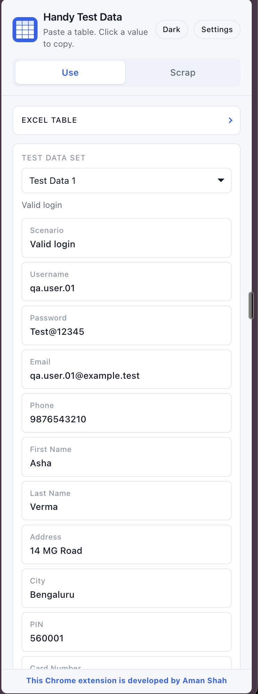
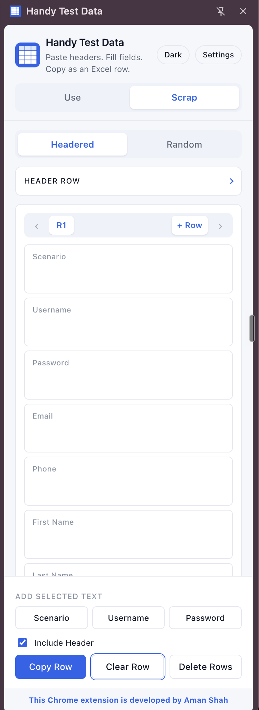
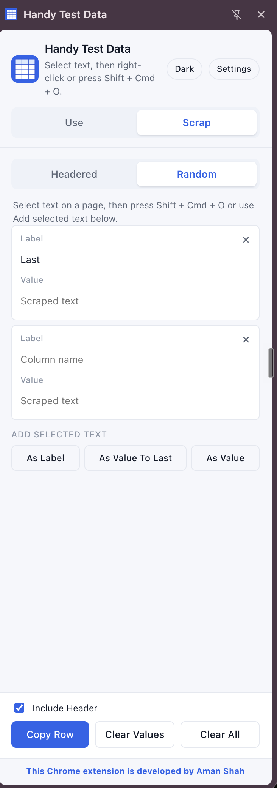
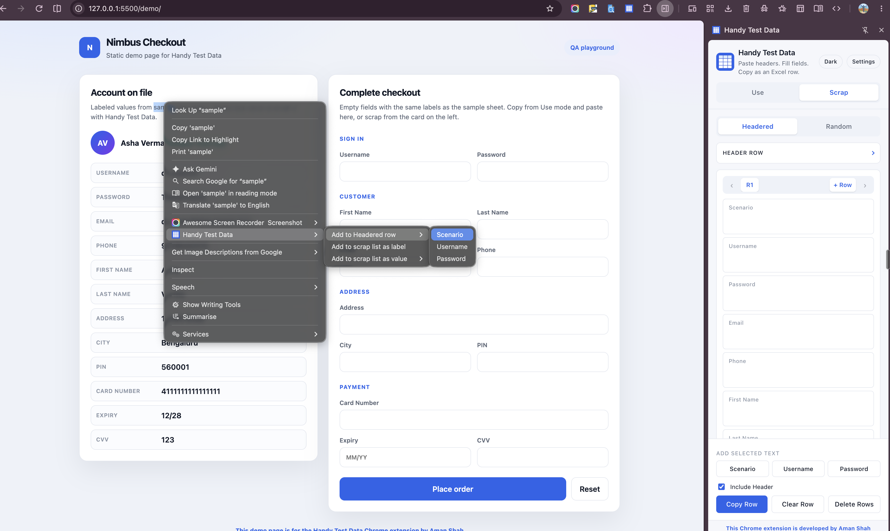
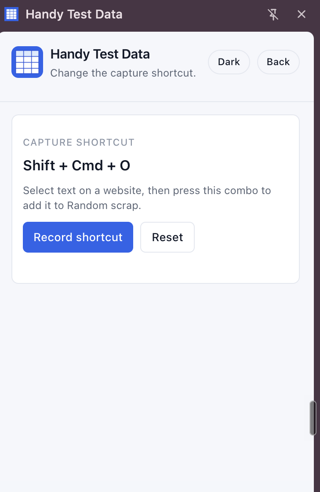

# Handy Test Data

Chrome **side-panel** helper for **manual testers and QA engineers**. Keep Excel or Google Sheets test data beside the site you are testing. Click a value to copy it, or scrape labels and values from the page into an Excel-ready row.

No login. No cloud. Data stays in Chrome on your computer.

Requires **Chrome 116+**. Developed by **Aman Shah**.

The repo is split into two folders:

- **`chrome-extension`** — the side panel you load unpacked in Chrome
- **`docs-and-samples`** — screenshots, sample spreadsheet, and the Nimbus Checkout demo page



## What it does

| You have | You do |
| --- | --- |
| An Excel sheet of test accounts | **Use** — paste the table, pick a row, click Username / Password / Email to copy |
| A website form to fill later | **Scrap → Headered** — same column names, capture selected text into R1, R2, … then copy rows back to Excel |
| Random text on a page | **Scrap → Random** — save as a label, as a value, or as a value on the last label |

You can capture with **sticky buttons**, a **keyboard shortcut**, or the **right-click menu**.

## Install

1. Open [chrome://extensions](chrome://extensions).
2. Turn on **Developer mode**.
3. **Load unpacked** and select the `chrome-extension` folder.
4. Pin **Handy Test Data** and click the icon. The side panel opens next to the current tab.

Reload the extension after code changes, then **refresh the website** you scrape.

If the shortcut never fires, assign it at [chrome://extensions/shortcuts](chrome://extensions/shortcuts).

## Try it in two minutes

1. Open [`docs-and-samples/sample-data/handy-test-data.csv`](docs-and-samples/sample-data/handy-test-data.csv) (or the `.xlsx`) in Excel or Sheets.
2. Copy the **header row plus the data rows**.
3. In the panel, stay on **Use**, paste into **Excel table**, click **Load**.
4. Choose **Test Data 1**. Click **Username** (`qa.user.01`) — it is copied.
5. Optional demo site: serve `docs-and-samples` and open `/demo/` (see [Demo page](#demo-page)).

The first pasted row is always the header. Later rows become Test Data 1, 2, 3, …

---

## Use mode — copy from your sheet

Use this when the spreadsheet already exists.


1. Paste header + rows from Excel or Google Sheets.
2. Pick a set from **Test data set** (Test Data 1 is “Valid login” in the sample).
3. Click any card to copy that cell.
4. Collapse **Excel table** to see more cards.
5. **Clear** removes the loaded table from the panel and from local storage.

The header button cycles **Dark → Light → Chrome**. **Chrome** follows the browser’s Light / Dark / Device setting. Chrome does not give extensions the Appearance color-grid chip, so pick the same color under **Settings → Chrome color**.

---

## Scrap → Headered — fill Excel columns from the page

Use this when you already know the column names (often the same headers as Use mode).



### Set headers

- **Use table headers** if you already loaded a sheet in Use mode, or
- Paste a header row and click **Set headers**.

You get one input per column: Scenario, Username, Password, Email, and so on.

### Multiple rows

- **+ Row** adds R2, R3, … with the same headers.
- **‹ R1 ›** switches the active row. If many rows overflow, the active chip stays in view with a neighbor on each side.

### Add selected text (sticky footer)

Select text on the website, then click a field-name button. Those three buttons stay visible while you scroll the cards.

- Default: the **next three empty columns after the last filled field**. If Scenario is filled, buttons are Username, Password, Email.
- If the last column is filled and earlier columns are still empty, the buttons show those empty labels instead.
- If every column has a value, the footer shows **All Fields Filled**.
- Clicking **any** value field pins the **first** button to that field, whether later columns are empty or filled. The other two still show the next empty columns.
- The pin is **remembered** when you leave the panel to select text on the page. It is released after you fill or edit that field, or when you focus another field, change row, or change headers.

The keyboard shortcut writes into the **first** of those buttons.

### Copy and clear

| Button | Effect |
| --- | --- |
| **Include Header** | Also copy the header line |
| **Copy Row / Copy Rows** | Copy every non-empty row as Excel TSV (paste into Sheets) |
| **Clear Row** | Blank the **active** row only |
| **Delete Rows** | Remove all row data; headers stay; you get empty R1 |

---

## Scrap → Random — capture without a header row

Use this when you are collecting bits of text and will name columns as you go.



1. Select text on the page.
2. **As Label** — new card, text in Label.
3. **As Value To Last Label** — puts the text in Value on the last labeled card (disabled until a label exists).
4. **As Value** — new card, text in Value, Label empty.
5. Shortcut: if the selection looks like `Email: jane@test.com`, two lines, or a tab, it can split label and value. If there is no label, the **whole selection** is saved as the value.
6. **×** on a card removes it. A blank card stays at the end so you can type the next pair.
7. **Copy Row** — labels become headers, values become one Excel row.
8. **Clear Values** — empty the values, keep labels. **Clear All** — delete every card.

---

## Capture from a website

Works on `http://` and `https://` pages. Not on `chrome://`, the Chrome Web Store, or most `file://` pages.

### Right-click menu



1. Select text on the page (the demo highlights a word such as “sample”).
2. Right-click → **Handy Test Data**:
   - **Add to Headered row** → every column on the active row (choosing a filled field overwrites it)
   - **Add to scrap list as label** — Random
   - **Add to scrap list as value** — pick an existing Random label

The screenshot shows the **Nimbus Checkout** demo beside Headered scrap: labeled “Account on file” on the left to scrape from, empty checkout fields on the right to paste into.

### Keyboard shortcut



Default suggested key is **Alt + Shift + S** (Windows/Linux) or **Option + Shift + S** (Mac). Chrome may not assign it until you set it under **Settings** or `chrome://extensions/shortcuts`.

The screenshot shows a recorded combo (**Shift + Cmd + O**). Use **Record shortcut**, then hold a modifier plus a key. **Reset** restores Alt + Shift + S.

- On **Headered**, the shortcut fills the first Add selected text target.
- On **Random**, it auto-splits a label if it can, otherwise saves the selection as a value.

---

## Demo page

[`docs-and-samples/demo/index.html`](docs-and-samples/demo/index.html) is a static checkout page built from the sample sheet: Username, Password, Email, Phone, First Name, Last Name, Address, City, PIN, Card Number, Expiry, CVV.

Serve it over HTTP (the extension cannot capture from `file://`):

```bash
cd docs-and-samples
python3 -m http.server 8000
```

Open [http://localhost:8000/demo/](http://localhost:8000/demo/). Load the sample CSV in **Use**, copy into the form, or scrap the “Account on file” card into **Headered** / **Random**.

---

## Privacy

Nothing is uploaded. Tables and scrap rows are stored in Chrome **local** storage on your device. The side panel does not call a backend.

| Permission | Why |
| --- | --- |
| sidePanel | Open beside the tab |
| storage | Save the table, scrap rows, theme, shortcut |
| contextMenus | Right-click capture |
| scripting, activeTab, site access | Read the current selection when you capture |

## Troubleshooting

| Problem | Fix |
| --- | --- |
| Shortcut does nothing | Reload the extension, refresh the **website**, set the key at `chrome://extensions/shortcuts` |
| Capture is empty | Select text on an http(s) page first |
| Headered buttons missing | Set headers first |
| Context menu out of date | Fill or switch a row so menus rebuild |
| Cannot capture | Avoid `chrome://`, Web Store, and local files |

## Project layout

```
HandlyTestData/
  chrome-extension/              load this folder in Chrome
    manifest.json
    sidepanel.html / .js / .css
    background.js                shortcut, menus, capture
    content.js                   page selection
    parser.js                    Excel TSV
    icons/
  docs-and-samples/
    screenshots/                 README images
    sample-data/                 handy-test-data.csv / .xlsx
    demo/index.html              static Nimbus Checkout playground
    scripts/generate_assets.py   icons and sample workbook
```

Made with a brain by **Aman Shah**.
